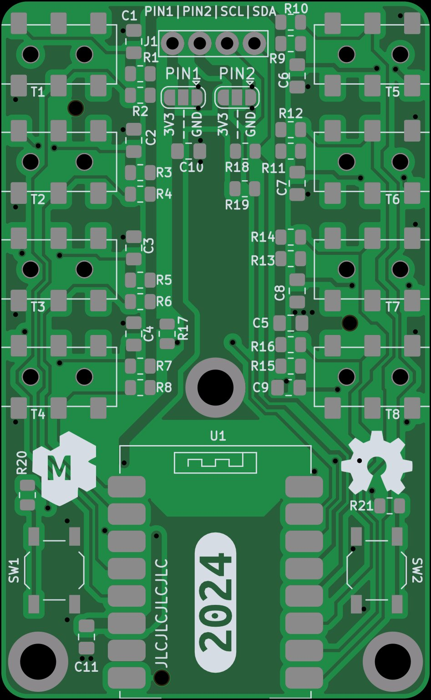
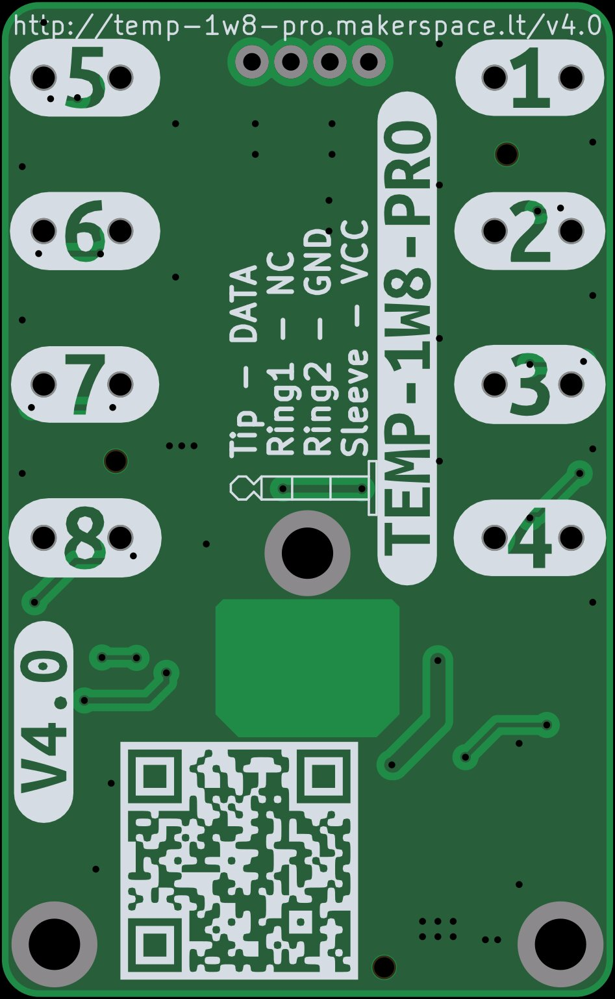
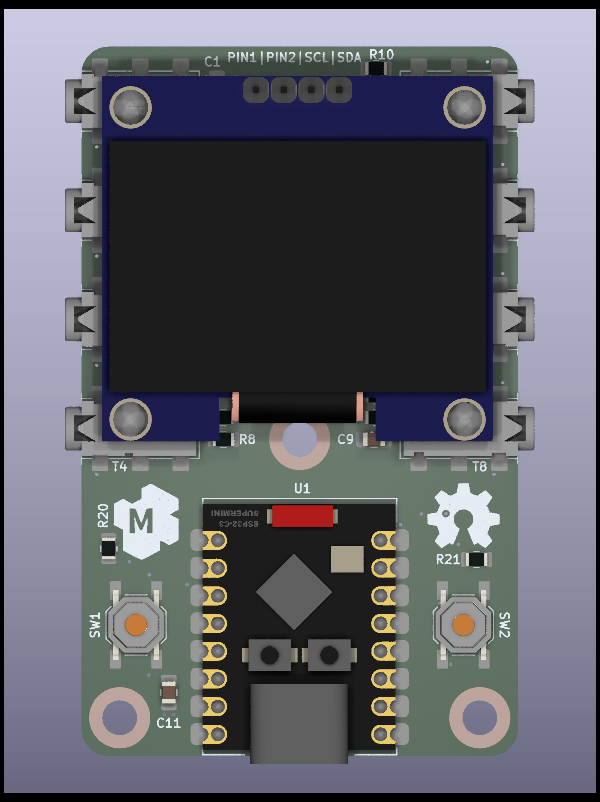

---

This device is meant for temperature monitoring with up to 8 thermometers.

NOTE: This is only a prototype now, so things might not work and everything might change 

Basic target features:

* 8x 1-wire interfaces for DS18b20 using 2.5mm 4p audio jack connectors
* 2x user programmable buttons (can be used to wake up from deep sleep)
* 128x64 OLED display
* Powered via USB-C
* Compatibility with esphome and Home Assistant

Dev NOTE: before commit, run `./kibot.sh` to regenerate documentation, bom, gerbers and other assets.

* [schematics.pdf](gen/schematics.pdf)
* [pcb.pdf with dimensions](gen/pcb.pdf)
* [ibom.html](gen/single/ibom.html)

---

